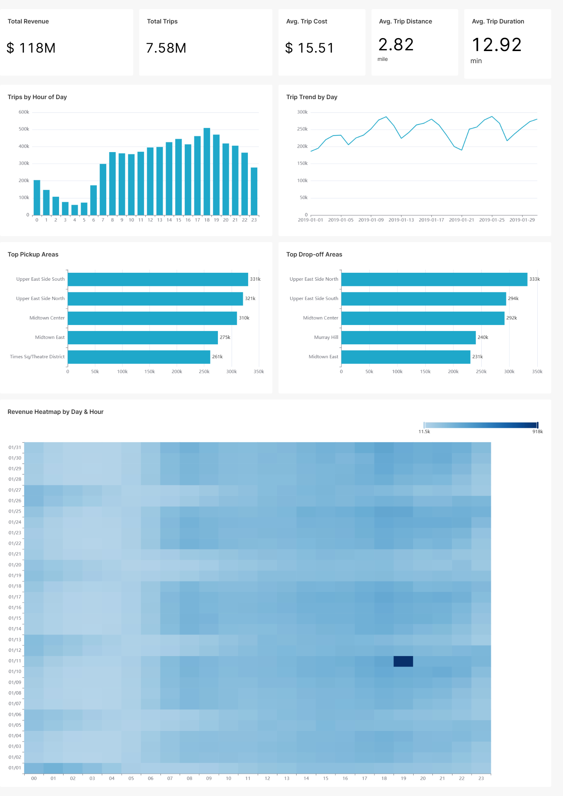

# taxi-analytics
# NYC Taxi Data Pipeline (ETL)

*[Русская версия](README.md)*

End-to-end аналитический проект на основе данных о поездках нью-йоркских такси — от исходных данных до интерактивного BI-дашборда.
Проект объединяет анализ данных, SQL, DWH, ETL/ELT-оркестрацию и BI для исследования выручки, количества поездок, спроса и географических закономерностей.

## Architecture

```
CSV (raw data)
   │
[ RAW ]  PostgreSQL — raw, unvalidated data (VARCHAR)
   │  PXF
[ CORE / DWH ]  Greenplum (MPP) — typing, cleaning
   │  PXF
[ DATA MART ]  ClickHouse — denormalized mart (One Big Table)
   │
[ BI ]  Apache Superset — dashboard for business analysis
```

Три слоя данных последовательно обрабатываются с помощью Apache Airflow:
1. `1_stage_raw_taxi_data` — загрузка CSV-файлов в PostgreSQL (raw layer)
2. `2_core_dwh_taxi_data` — перенос и преобразование данных в Greenplum (core layer)
3. `3_marts_clickhouse_taxi_data` — построение аналитического data mart в ClickHouse

Подробное описание DAG'ов и отдельных задач находится в docs/PIPELINE.md.

## Технологический стек
* **Аналитика и SQL:** SQL, PostgreSQL
* **Хранилище данных:** Greenplum (MPP)
* **Data Mart:** ClickHouse
* **Оркестрация:** Apache Airflow
* **BI и визуализация:** Apache Superset
* **Инфраструктура:** Docker / Docker Compose
* **Интеграция между базами данных:** PXF
* **Анализ данных:** Python, Pandas, Jupyter Notebook

## Архитектура данных

**Raw** — хранение исходных данных с минимальными преобразованиями.
**Core / DWH** — очистка и приведение типов данных, формирование централизованных аналитических сущностей, таких как поездки и зоны.
**Data Mart** — денормализованный слой, оптимизированный для BI-запросов и аналитики.

## Дашборд



### Основные результаты анализа

Анализ выполнен на выборке данных NYC TLC за январь 2019 года.

**Общая выручка:** $118 млн при 7,58 млн поездок, средняя стоимость поездки — $15,51.
**Средняя поездка:** 2,82 мили и 12,92 минуты.
**Пиковый спрос:** приходится на период с 17:00 до 19:00.
**Наиболее популярные зоны отправления и назначения:** Upper East Side South, Upper East Side North и Midtown Center.
**Качество данных:** исходный набор содержит некорректные даты и поездки с нулевой или отрицательной стоимостью, которые фильтруются до формирования аналитического data mart.

## Локальный запуск

Для настройки проекта используется файл .env. Создайте его на основе переменных, указанных в docker-compose.yml.

docker compose up -d

Если проект уже запускался и его необходимо перезапустить:

docker compose down
docker compose up -d

Для запуска пайплайна откройте Airflow UI и последовательно запустите DAG'и:

1_stage_raw_taxi_data
        ↓
2_core_dwh_taxi_data
        ↓
3_marts_clickhouse_taxi_data

### Порты:
* **Apache Airflow UI:** [http://localhost:8080](http://localhost:8080)
* **Apache Superset UI:** [http://localhost:8088](http://localhost:8088)
* **PostgreSQL (Raw):** `localhost:5433` (DB: `rawdb`, schema: `raw`)
* **Greenplum (DWH):** `localhost:5434` (DB: `dwh`)
* **ClickHouse (Marts):** `localhost:8123` (DB: `dm_ch`)

## Структура репозитория
```
├── research/                   # EDA и ad-hoc анализ в Jupyter Notebook
├── services/
│   ├── airflow/
│   │   ├── dags/               # Airflow DAG'и
│   │   │   └── sql/
│   │   │       ├── raw/        # SQL для raw layer
│   │   │       ├── core/       # SQL для DWH / Greenplum
│   │   │       └── dm/         # SQL для data mart / ClickHouse
│   │   └── data/               # Исходные CSV (не загружаются в репозиторий)
│   ├── postgres/init/          # Инициализация PostgreSQL
│   ├── clickhouse/init/        # Инициализация ClickHouse
│   ├── greenplum/              # Docker-образ Greenplum + PXF
│   └── superset/               # Конфигурация Superset
├── docs/
│   ├── dashboard.png           # Скриншот итогового дашборда
│   └── PIPELINE.md             # Документация по пайплайну и DAG'ам
├── docker-compose.yml
├── .gitignore
└── README.md
```
