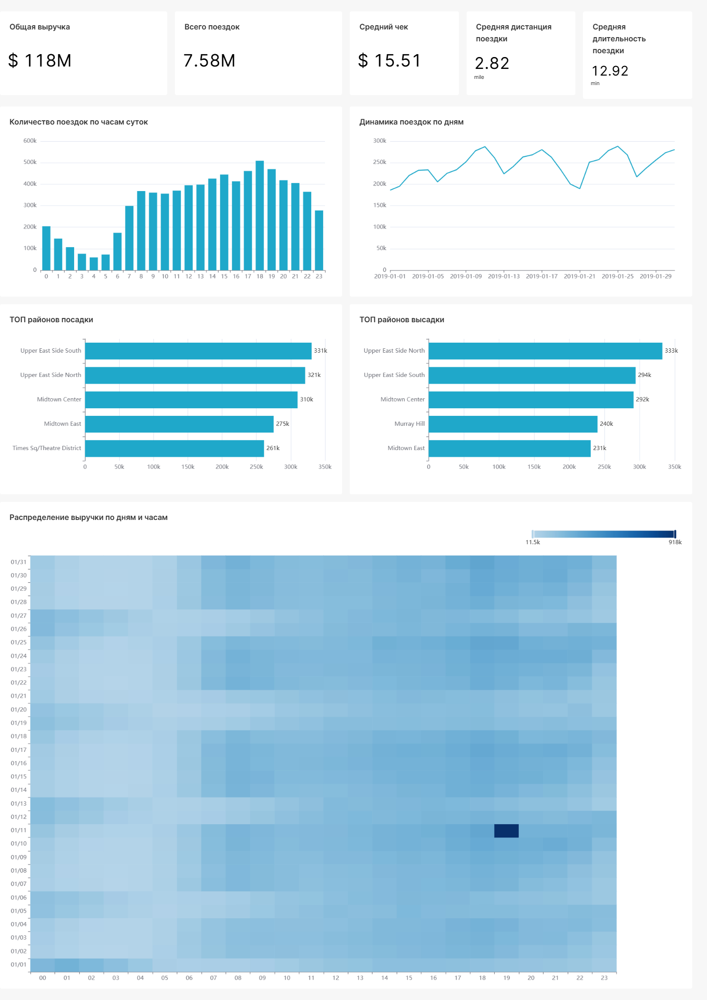

# taxi-analytics
# NYC Taxi Data Pipeline (ETL)

*[English version](README.en.md)*

Сквозной аналитический пайплайн: от сырых CSV с поездками нью-йоркского такси до
интерактивного дашборда в Superset. Проект демонстрирует полный цикл: проектирование слоёв хранения, архитектурную логику, оркестрацию в Airflow и построение BI-витрины.

## Архитектура

```
CSV (raw data)
   │
[ RAW ]  PostgreSQL — сырые данные без валидации (VARCHAR)
   │  PXF
[ CORE / DWH ]  Greenplum (MPP) — типизация, очистка.
   │  PXF
[ DATA MART ]  ClickHouse — денормализованная витрина (One Big Table)
   │
[ BI ]  Apache Superset — дашборд для бизнес-анализа
```

Оркестрация всех трёх слоёв — Apache Airflow, три последовательных DAG-а:
1. `1_stage_raw_taxi_data` — загрузка CSV в PostgreSQL (raw)
2. `2_core_dwh_taxi_data` — перенос и типизация данных в Greenplum (core)
3. `3_marts_clickhouse_taxi_data` — построение витрины в ClickHouse (mart)

Подробный разбор каждого DAG-а и его тасков — в [`docs/PIPELINE.md`](docs/PIPELINE.md).

## Стек технологий
* **Оркестрация:** Apache Airflow
* **Сырой слой (Raw):** PostgreSQL
* **Хранилище данных (DWH):** Greenplum (MPP СУБД)
* **Витрины данных (Data Marts):** ClickHouse
* **BI-аналитика и дашборды:** Apache Superset
* **Инфраструктура:** Docker / Docker Compose
* **Интеграция между СУБД:** PXF (Platform Extension Framework)

## Почему такая архитектура

Каждый слой решает одну задачу:
- **Raw** — принимает данные "как есть", без потерь при сбое источника.
- **Core/DWH** — приводит данные к правильным типам и создает централизованное хранилище чистых данных по сущностям (поездки, зоны).
- **Data Mart** — денормализованная витрина, оптимизированная под скорость чтения
  для BI, а не под целостность.

## Дашборд



### Ключевые инсайты (январь 2019, выборка из данных NYC TLC)

- **Общая выручка** за месяц — $118M при **7.58M** поездок, средний чек — **$15.51**.
- **Средняя поездка** — 2.82 мили и 12.92 минуты — типичная внутригородская
  поездка, а не аэропортовый трансфер.
- **Пиковая нагрузка** приходится на 17:00–19:00 (вечерний час пик).
- **Топ районов посадки и высадки**: Upper East Side South/North, Midtown Center —
  деловой и жилой центр Манхэттена доминирует, что ожидаемо для NYC yellow taxi.
- **Данные требуют очистки перед анализом**: в исходном датасете встречаются
  поездки с некорректными датами и нулевыми/отрицательными суммами — в витрину
  они не попадают благодаря фильтрам качества в `extract_gp_obt_data.sql`.

## Как запустить локально

Проект использует файл конфигурации `.env` (создай его по образцу переменных,
на которые ссылается `docker-compose.yml`).

```bash
docker compose up -d
```

Если стенд уже запускался раньше и нужно перезапустить — используй `docker compose
down` + `docker compose up -d`

Запуск пайплайна: в Airflow UI (см. порты ниже) запустить DAG-и по порядку —
`1_stage_raw_taxi_data` → `2_core_dwh_taxi_data` → `3_marts_clickhouse_taxi_data`.

### Карта сетевых портов:
* **Apache Airflow UI:** [http://localhost:8080](http://localhost:8080)
* **Apache Superset UI:** [http://localhost:8088](http://localhost:8088)
* **PostgreSQL (Raw):** `localhost:5433` (База: `rawdb`, Схема: `raw`)
* **Greenplum (DWH):** `localhost:5434` (База: `dwh`)
* **ClickHouse (Marts):** `localhost:8123` (База: `dm_ch`)

## Структура репозитория

```
├── research/                    # EDA и ad-hoc аналитика в pandas (Jupiter NoteBook)
├── services/
│   ├── airflow/
│   │   ├── dags/                 # DAG-и Airflow (1_stage, 2_core, 3_marts)
│   │   │   └── sql/
│   │   │       ├── raw/          # DDL/подготовка raw-слоя
│   │   │       ├── core/         # DDL и загрузка DWH (Greenplum)
│   │   │       └── dm/           # DDL и построение витрины (ClickHouse)
│   │   └── data/                 # исходные CSV (не коммитятся, см .gitignore)
│   ├── postgres/init/            # init-скрипты Postgres
│   ├── clickhouse/init/          # init-скрипты ClickHouse
│   ├── greenplum/                # Dockerfile для кастомного образа Greenplum+PXF
│   └── superset/                 # конфигурация и инициализация Superset
├── docs/
│   ├── dashboard.png             # скриншот финального дашборда
│   └── PIPELINE.md               # построчный разбор DAG-ов и тасков
├── docker-compose.yml
├── .gitignore
└── README.md
```
